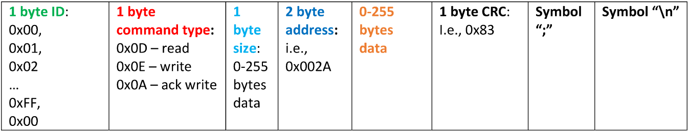

## Serial communication protocol for embedment in a medical device

The project is intented to be viewed and built using the EmbeddedStudio IDE

The project is an implementation of a communication protocol of 3 layers on an STM32F7 microcontroller system.
Its final goal is to be used as a means of communication of runtime variables such as different sensor outputs between two microcontroller systems in the same device.
It is implemented using the STM32 Cube HAL and the RTOS SEGGER embOS, which is certified for functional safety in accordance to IEC 61508 SIL 3 and IEC 62304 Class C.
It is implemented entirely in the C programming language.

### Hardware layer

The hardware layer uses the UART interface on the microcontroller.
It encompasses the driver for the interface and the communication with the middle layer via an OS Mailbox.

### Middle layer

The middle layer features error detection utilizing CRC and the separation of the devices into a Master-Slave architecture with one device sending commands for writing or reading and the other acknowledging and returning read data.

### Application layer

The application layer consists of two memory spaces, which are manipulated by the user of the protocol using the provided calls: <i>safeRead</i> and <i>safeWrite</i>.

